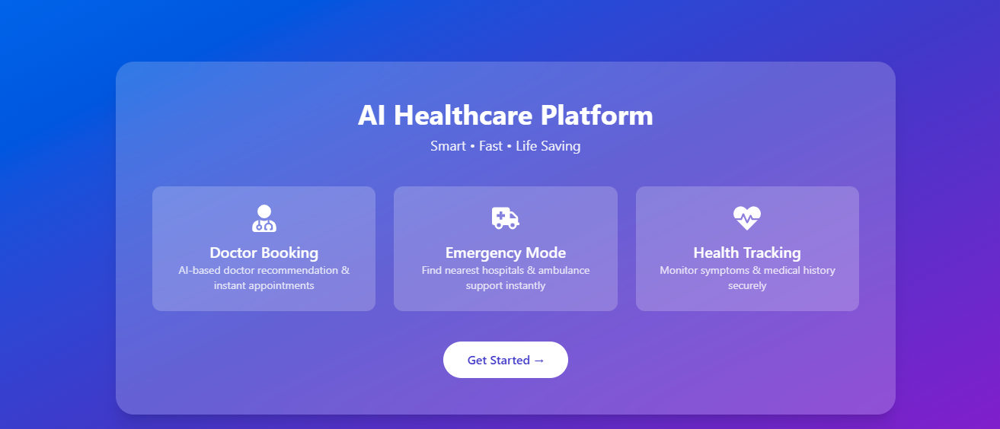
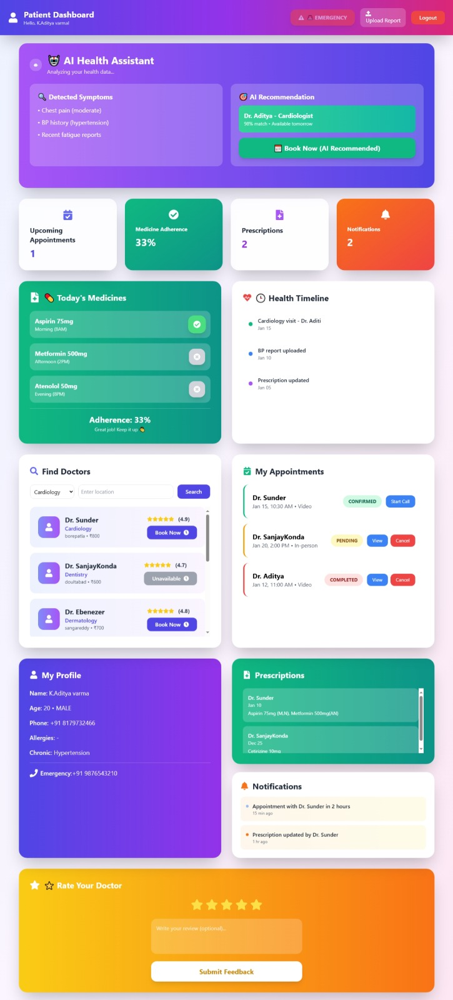
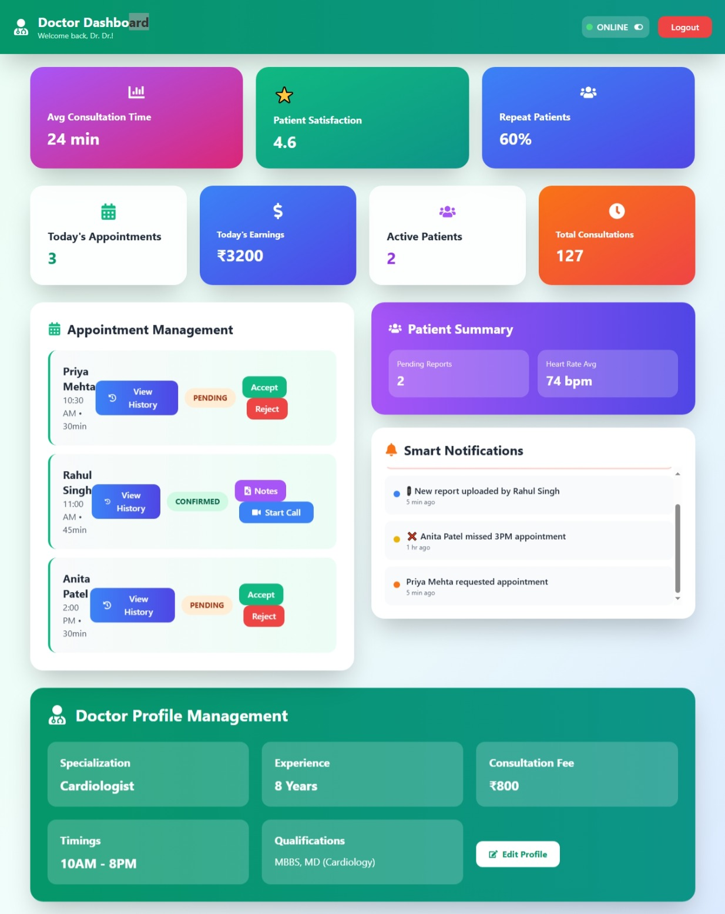

SmartCure – Unified Healthcare Web Application

## Team Name
SmartCure

## Team Members
- Kalidindi Aditya Varma  
- Sunder Kumar  
- Sanjay Ramaswamy Komshetpally  

## Selected Theme
Healthcare – Technology-driven solution to improve health services and patient care.

## Project Overview
SmartCure is a unified healthcare web application designed to simplify medical services for patients, doctors, and pharmacies.  
The platform helps users book appointments, manage prescriptions, and order medicines easily from one place.

This project is developed as part of a hackathon to solve real-world healthcare problems using modern web technologies.

## Key Features

### Patient Module
- User registration and login
- Book doctor appointments
- View appointment history
- Access doctor-approved prescriptions

### Doctor Module
- Doctor login
- View patient appointments
- Approve prescriptions
- Manage availability

## Technology Stack
- Frontend: React.js
- Backend: Node.js, Express.js
- Database: MongoDB
- Authentication: JWT
- Version Control: Git & GitHub

## Project Status
- Frontend: Completed and functional
- Backend: Implemented (database connection may require local MongoDB or cloud setup)
- Suitable for hackathon demo and submission

## Screenshots

### Home Page

### Patient Dashboard

### Doctor Dashboard

## To Run use

npm install
npm start
Note: MongoDB setup is required for full backend functionality.

Future Scope

-Online medicine delivery integration

-AI-based doctor recommendation

-Cloud database deployment

-Payment gateway integration

-Mobile application version

